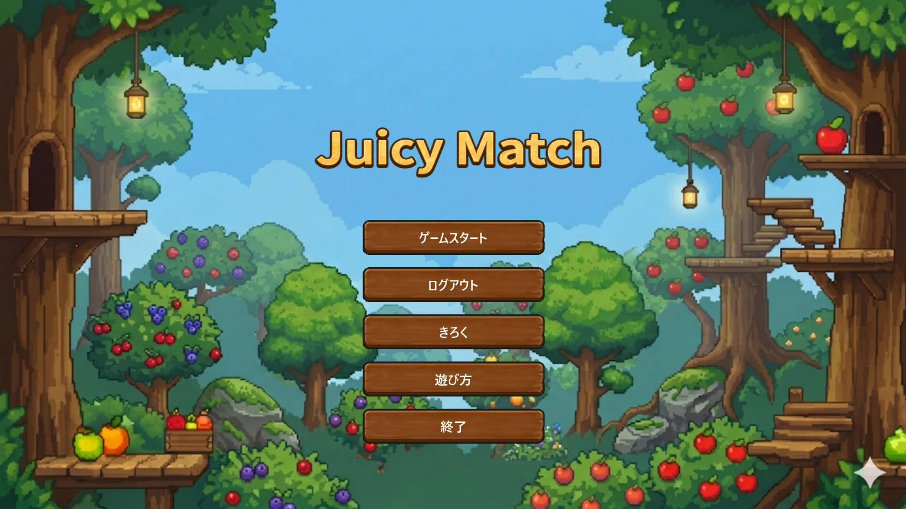
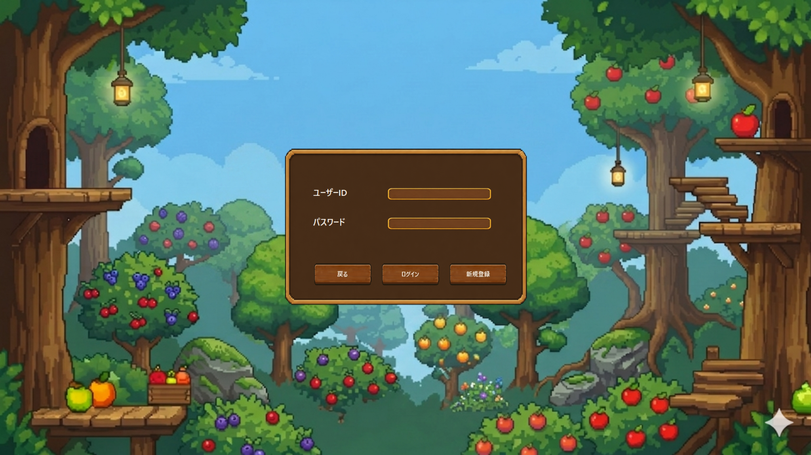
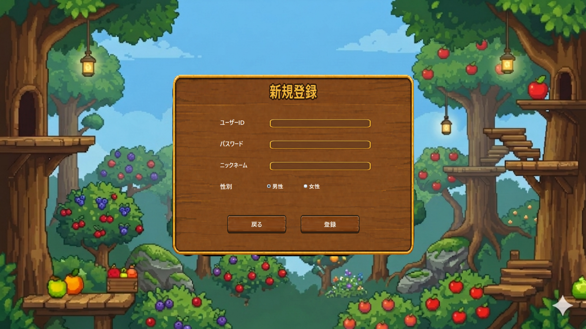
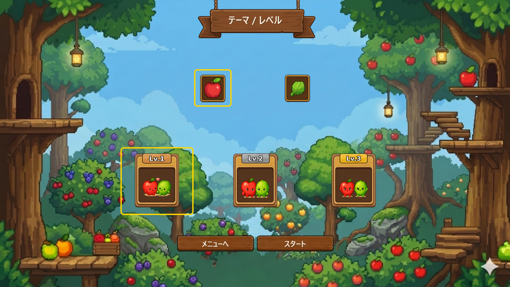
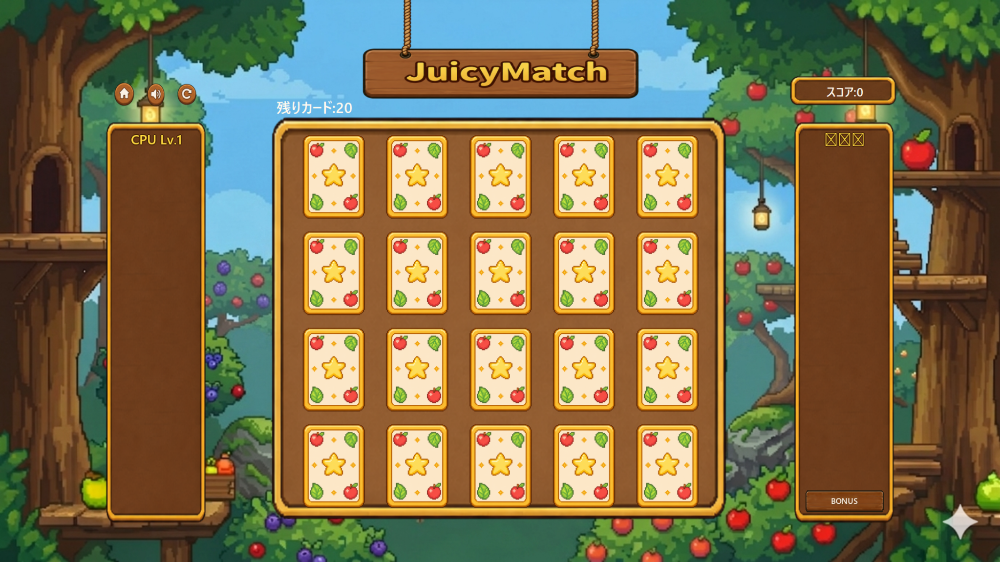
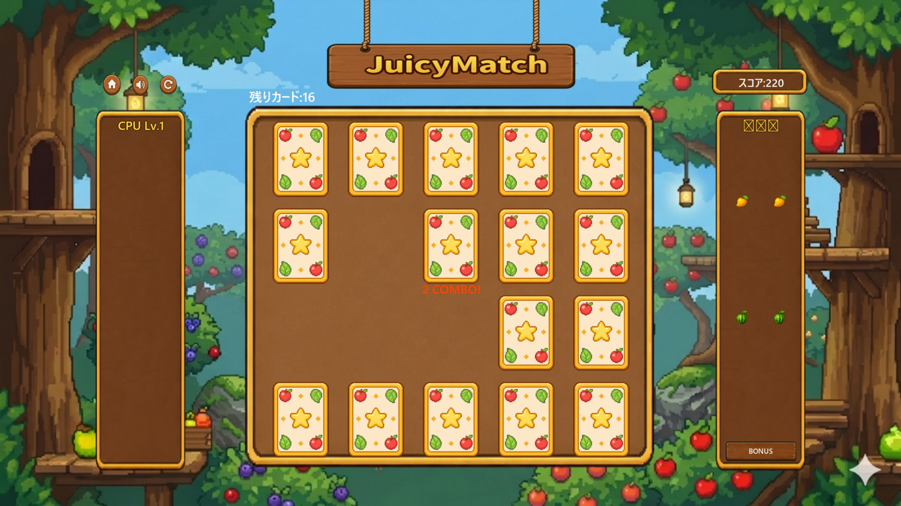
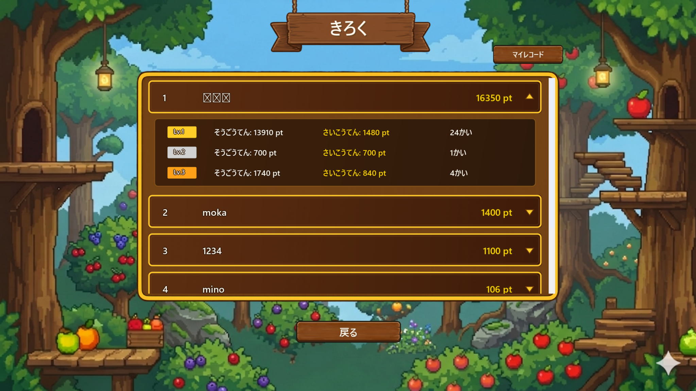
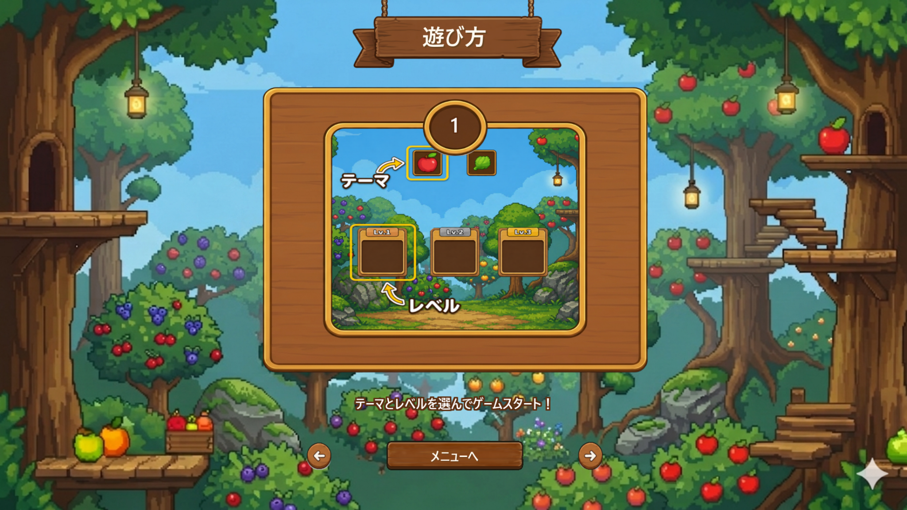

# 🍎 JuicyMatch

<p align="center">
  
</p>

<p align="center">
  <b>Java Swingで制作したフルーツカード・マッチングゲーム</b><br/>
  テーマとレベルを選び、カードの位置を記憶しながら同じ絵柄のペアをそろえるデスクトップゲームです。
</p>

<p align="center">
  
  
  
  
</p>

---

## 📌 概要

**JuicyMatch**は、Java Swingを用いて制作したカードマッチングゲームです。

プレイヤーはフルーツ・野菜のテーマと難易度を選択し、ゲーム開始時に表示されるカードの位置を覚えながら、同じ絵柄のカードを2枚ずつそろえてスコアを獲得します。連続でペアをそろえるとコンボが発生し、ボーナススコアを得られる仕組みにしています。

また、ログイン・新規登録・スコア保存・ランキング表示をMySQLと連携し、単なるミニゲームではなく、ユーザー情報とプレイ記録を管理できるデスクトップアプリケーションとして実装しました。

---

## 🎮 画面イメージ

<table>
  <tr>
    <td align="center" width="50%">
      <br/>
      <b>ログイン</b><br/>
      ユーザーIDとパスワードでログインします。
    </td>
    <td align="center" width="50%">
      <br/>
      <b>新規登録</b><br/>
      ID、パスワード、ニックネーム、性別を入力してアカウントを作成します。
    </td>
  </tr>
  <tr>
    <td align="center" width="50%">
      <br/>
      <b>テーマ / レベル選択</b><br/>
      フルーツ・野菜テーマとLv.1〜Lv.3の難易度を選択します。
    </td>
    <td align="center" width="50%">
      <br/>
      <b>ゲーム画面</b><br/>
      カードの位置を覚え、同じ絵柄のペアをそろえます。
    </td>
  </tr>
  <tr>
    <td align="center" width="50%">
      <br/>
      <b>コンボ / ボーナススコア</b><br/>
      連続でペアをそろえるとCOMBOが発生し、ボーナススコアを獲得できます。
    </td>
    <td align="center" width="50%">
      <br/>
      <b>ランキング</b><br/>
      ユーザーごとのスコアやレベル別の記録を確認できます。
    </td>
  </tr>
</table>

---

## 🕹️ 遊び方

<p align="center">
  
</p>

ゲーム内には、操作方法を説明する4ページ構成の `遊び方` 画面を実装しています。

1. テーマとレベルを選んでゲームスタート！
2. カードの位置を覚えて、同じ絵柄のペアをそろえましょう！
3. 連続成功でCOMBO！ボーナススコアをゲット！
4. たくさんペアをそろえて、高得点を目指そう！

---

## ✨ 主な機能

### ユーザー管理

* 新規登録
* ログイン
* ニックネーム / 性別の保存
* MySQLを用いたユーザー情報管理

### ゲーム進行

* フルーツ / 野菜テーマの選択
* Lv.1、Lv.2、Lv.3の難易度選択
* ゲーム開始時のカード位置プレビュー
* カード選択とペア判定
* 残りカード数の表示
* スコアのリアルタイム反映

### スコア / ランキング

* ペア成立時のスコア加算
* 連続成功時のコンボボーナス
* ゲーム終了後の記録保存
* 全体ランキング表示
* ユーザーごとのレベル別記録表示

### UI / サウンド

* Java SwingによるカスタムUI
* 木目調のボタン・パネルデザイン
* メインBGM / ゲーム中BGM
* ボタンクリック音 / カード効果音 / 成功効果音
* ミュートボタンとミュート状態の視覚表示

---

## 🛠️ 技術スタック

| 区分              | 使用技術                    |
| --------------- | ----------------------- |
| Language        | Java                    |
| GUI             | Java Swing, Java AWT    |
| Database        | MySQL                   |
| DB Access       | JDBC, MySQL Connector/J |
| IDE             | IntelliJ IDEA           |
| Version Control | Git, GitHub             |

---

## 📁 ディレクトリ構成

```text
JuicyMatch/
├── lib/
│   ├── README.md
│   └── mysql-connector-j-9.7.0.jar
│
├── src/
│   ├── db.properties.example
│   ├── db.properties              # ローカル実行用 / GitHubには含めない
│   │
│   └── cardGame/
│       ├── database/              # DB接続とDAO
│       ├── entity/                # User, Record, Cardなどのドメインクラス
│       ├── game/                  # ゲームの実行制御と主要ロジック
│       ├── game/config/           # 画面座標・サイズなどの定数管理
│       ├── game/components/       # 共通Swingコンポーネント
│       ├── game/panels/           # メニュー、ログイン、ランキングなどの画面パネル
│       ├── game/ui/               # 分離したUI描画コンポーネント
│       ├── img/                   # 画像リソース
│       └── sound/                 # サウンドリソース
│
├── docs/
│   └── images/                    # README用スクリーンショット
│
├── .gitignore
└── README.md
```

---

## 🚀 セットアップ / 実行方法

### 1. リポジトリをクローン

```bash
git clone https://github.com/ユーザー名/JuicyMatch.git
cd JuicyMatch
```

> `ユーザー名` は自分のGitHubアカウント名に置き換えてください。

---

### 2. IntelliJ IDEAでプロジェクトを開く

1. IntelliJ IDEAを起動
2. `Open` を選択
3. `JuicyMatch` フォルダを選択
4. `src`、`lib`、`docs` フォルダが表示されていることを確認

---

### 3. JDKを設定

Java 17以上を推奨しています。

```text
File > Project Structure > Project > SDK
```

推奨環境:

```text
JDK 17以上
JDK 21推奨
```

---

### 4. MySQL Connector/Jを登録

このプロジェクトではMySQL接続のために以下のJARファイルを使用します。

```text
lib/mysql-connector-j-9.7.0.jar
```

IntelliJ IDEAで自動認識されない場合は、以下の手順で登録します。

```text
File > Project Structure > Libraries > + > Java
```

その後、以下のファイルを選択してください。

```text
lib/mysql-connector-j-9.7.0.jar
```

---

### 5. MySQLデータベースを作成

MySQLに接続し、以下のSQLを実行します。

```sql
CREATE DATABASE card_game_db;
USE card_game_db;
```

---

### 6. テーブルを作成

以下のSQLを実行します。

```sql
CREATE TABLE users (
    username VARCHAR(50) PRIMARY KEY,
    password VARCHAR(100) NOT NULL,
    nickname VARCHAR(50) NOT NULL,
    gender VARCHAR(10) NOT NULL
);

CREATE TABLE game_records (
    record_id INT AUTO_INCREMENT PRIMARY KEY,
    username VARCHAR(50) NOT NULL,
    score INT NOT NULL,
    level INT NOT NULL,
    play_time DATETIME NOT NULL DEFAULT CURRENT_TIMESTAMP,
    CONSTRAINT fk_game_records_user
        FOREIGN KEY (username)
        REFERENCES users(username)
        ON DELETE CASCADE
);
```

---

### 7. DB設定ファイルを作成

セキュリティ上、実際のDB接続情報を含む `src/db.properties` はGitHubにアップロードしていません。

まず、サンプルファイルをコピーします。

```text
src/db.properties.example → src/db.properties
```

次に、`src/db.properties` を自分のローカルDB環境に合わせて編集します。

```properties
url=jdbc:mysql://localhost:3306/card_game_db?serverTimezone=Asia/Seoul&useSSL=false&allowPublicKeyRetrieval=true
username=YOUR_DB_USERNAME
password=YOUR_DB_PASSWORD
```

例:

```properties
url=jdbc:mysql://localhost:3306/card_game_db?serverTimezone=Asia/Seoul&useSSL=false&allowPublicKeyRetrieval=true
username=root
password=1234
```

> `db.properties.example` ではなく、実行時に読み込まれる `db.properties` を編集してください。

---

### 8. 実行クラス

以下のクラスを実行します。

```text
cardGame.game.GameController
```

IntelliJ IDEAでは、以下のように実行できます。

```text
src/cardGame/game/GameController.java を右クリック > Run 'GameController.main()'
```

---

## 🔐 セキュリティ / Git管理

### DB設定ファイルの除外

`src/db.properties` には実際のDBユーザー名とパスワードが含まれるため、GitHubにはアップロードしません。

```gitignore
src/db.properties
```

代わりに、設定例として以下のファイルを管理しています。

```text
src/db.properties.example
```

### ビルド成果物の除外

コンパイル済みファイルやビルド成果物はGitHubに含めません。

```gitignore
*.class
bin/
classes/
out/
build/
target/
```

---

## ♻️ リファクタリング

完成後、コードの可読性と保守性を高めるためにリファクタリングを行いました。

### 長くなったクラスの分割

開発初期は `GameWindow.java` と `RankingPanel.java` にUI生成処理とロジックが集中していました。機能追加のたびにファイルが肥大化し、役割の把握や修正箇所の特定が難しくなったため、責務ごとにクラスを分割しました。

| 分離クラス                        | 役割                      |
| ---------------------------- | ----------------------- |
| `GameWindowLayout.java`      | ゲーム画面の座標・サイズ定数を管理       |
| `GameImagePanel.java`        | 画像ベースのパネル描画             |
| `GameIconButtonFactory.java` | ホーム / リセット / ミュートボタンの生成 |
| `GameTextPainter.java`       | アウトライン付きテキスト描画          |
| `InGameScoreBox.java`        | プレイヤーのスコア表示UI           |
| `MatchedScorePanel.java`     | マッチしたカードの表示パネル          |
| `RankingLayout.java`         | ランキング画面の座標・サイズ定数を管理     |
| `RankingRowPanel.java`       | ランキング行の描画と展開 / 折りたたみUI  |
| `RankingScrollBarUI.java`    | カスタムスクロールバーUI           |

### 整理した内容

* 未使用クラスの削除
* `.class` ファイルの削除
* DBパスワードの除外と `db.properties.example` の追加
* 日本語コメントの整理
* 重要なメソッドへの韓国語 / 英語コメント追加
* `.gitignore` の整理

---

## 🧯 トラブルシューティング

### `properties에서 'url' 설정을 찾을 수 없습니다.` が表示される場合

`db.properties` のキー名がコードと一致していない場合に発生します。

正しい形式:

```properties
url=jdbc:mysql://localhost:3306/card_game_db?serverTimezone=Asia/Seoul&useSSL=false&allowPublicKeyRetrieval=true
username=root
password=YOUR_PASSWORD
```

誤った形式:

```properties
db.url=...
db.user=...
db.password=...
```

---

### `Public Key Retrieval is not allowed` が表示される場合

JDBC URLに以下のオプションを追加してください。

```text
allowPublicKeyRetrieval=true
```

例:

```properties
url=jdbc:mysql://localhost:3306/card_game_db?serverTimezone=Asia/Seoul&useSSL=false&allowPublicKeyRetrieval=true
```

---

### MySQL Connectorが見つからない場合

エラー例:

```text
ClassNotFoundException: com.mysql.cj.jdbc.Driver
```

確認項目:

1. `lib/mysql-connector-j-9.7.0.jar` が存在するか
2. IntelliJ IDEAの `Project Structure > Libraries` にJARが登録されているか

---

### サウンド関連の警告が表示される場合

一部の環境では、Java Sound APIがWAVファイルのフォーマットに関する警告を表示する場合があります。

```text
No line matching interface Clip supporting format ...
```

実際にサウンドが再生されている場合、ゲーム進行には大きな影響はありません。コンソール出力が気になる場合は、`Sound.java` のデバッグ出力設定を調整できます。

---

## 📝 制作を通して学んだこと

今回のプロジェクトを通して、Java SwingでゲームUIを直接構築する際の難しさを実感しました。Swingではコンポーネントの位置やサイズを細かく調整する必要があり、ボタン・パネル・画像の配置を何度も確認しながら修正する作業に多くの時間がかかりました。

開発初期は、ゲームロジックとUIコードが1つのファイルに混在していたため、コード量が増えるにつれて可読性が低下し、機能修正時に関連メソッドを探すのが難しくなりました。その後、`GameWindow` や `RankingPanel` などの大きなクラスを役割ごとに分割することで、コードの見通しと保守性を改善できました。

また、最初は `.txt` ファイルでユーザー情報や記録を管理しようとしましたが、セキュリティやデータ整合性の面で課題があると感じ、MySQLを用いた管理方式に変更しました。これにより、ユーザー情報とゲーム記録をより構造的に扱えるようになりました。

GitHubに公開する過程では、DBパスワードを含む設定ファイルを除外し、代わりに `db.properties.example` を提供する形に整理しました。また、`.class` ファイルやビルド成果物を除外し、ソースコードと必要なリソースを中心に管理することで、ポートフォリオとして見やすいリポジトリ構成を意識しました。

---

## 🔧 今後の改善点

* MavenまたはGradleを用いたプロジェクト構成への移行
* DBテーブル作成SQLの別ファイル化
* 実行可能JARとしての配布形式の整備
* サウンド音量調整機能の追加
* カード反転アニメーションの改善
* ランキングのフィルター / ソート機能追加
* テストコードの追加

---

## 📄 リソース / ライセンス

### 画像リソース

本プロジェクトの画像リソースは、`Gemini Nano Banana 2` と `ChatGPT Image` を活用して制作・編集しました。

### BGM

BGMにはPeriTuneの無料BGMを使用しました。

| 使用箇所           | ファイル名           | 曲名                                                                   | 出典       |
| -------------- | --------------- | -------------------------------------------------------------------- | -------- |
| メイン画面 / メニュー画面 | `Mainmusic.wav` | [Portside Café](https://peritune.com/blog/2026/03/13/portside-cafe/) | PeriTune |
| ゲーム画面          | `Casino.wav`    | [Resort5](https://peritune.com/blog/2021/08/09/resort5/)             | PeriTune |

### 効果音

ボタンクリック音、カード効果音、マッチ成功効果音などは、ChatGPTを活用して制作・編集しました。

### 注意事項

本プロジェクトのリソースはポートフォリオ目的で使用しています。
外部リソースは各提供元のライセンス条件に従い、音楽ファイル単体の再配布・販売は行いません。
